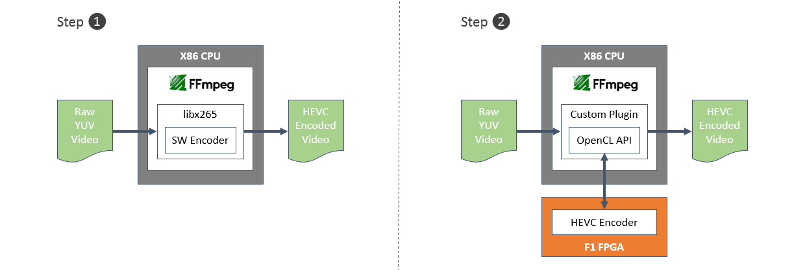

  <tr>
    <th width="100%" colspan="5"><h2>XDF 2018 - NGCodec Demo</h2></th>
  </tr>

---------------------------------------

### Experiencing FP1c Acceleration

In this module you will experience the acceleration potential of Huawei cloud FP1c instances by using ```ffmpeg``` to encode video stream files, and compare the performance with the libx265 codec running on CPU.



```ffmpeg``` is a very popular framework providing very fast video and audio converters. The ```ffmpeg``` code is open-source and allows for the addition of custom plugins. For this workshop, a custom plugin has been created to transparently use the NGCodec HEVC encoder running on Huawei FP1c.  

Users can switch between the libx265 software codec and the FP1c-accelerated implementation by simply changing a parameter on the ```ffmpeg``` command line. The plugin uses OpenCL API calls to write video frames to the FPGA, execute the encoder and read back the compressed video.

The HEVC encoder is provided courtesy of **NGCodec** [(www.ngcodec.com)](www.ngcodec.com).

#### Setting-up the workshop

1. Open a new terminal by right-clicking anywhere in the Desktop area and selecting **Open Terminal**.
1. Navigate to the NGCodec_demo directory.
    ```bash
    cd /XDF/NGCodec_demo/FFmpeg/build
    ```

1. Source the SDAccel runtime environment.
    ```bash
    source /XDF/huaweicloud-fpga/fp1/setup.sh
    ```

#### Step 1: Running with the encoder on the CPU

1. Encode using the libx265 software codec running on the CPU.
    ```bash
    sh hevc_tst_cpu.cmd
    ```

    The encoder will finish with a message similar to this one: \
    frame=  240 fps= 16 q=-0.0 Lsize=    2183kB time=00:00:09.52 bitrate=1878.2kbits/s
    > **fps** measures the performance of the encoder in processed frames per second. \
    **size** measures the size of the compressed output file. \


#### Step 2: Running with the encoder on the FP1c FPGA

1. Set up environement
   ```bash
   XILINX_SDX_PATH=${XILINX_SDX}
   export LD_LIBRARY_PATH=${XILINX_SDX_PATH}/runtime/lib/x86_64:${XILINX_SDX_PATH}/lib/lnx64.o/Default:${XILINX_SDX_PATH}/lib/lnx64.o:$(pwd)/../../xmaapi/lib
   export XILINX_OPENCL=$(pwd)/../../../userspace/sdaccel/lib
   ```

1. Encode using the NGCodec HEVC encoder running on the FP1c FPGA.
    ```bash
    sh hevc_tst.cmd
    ```

    The encoder will finish with a message similar to this one: \
    frame=  240 fps= 42 q=-0.0 Lsize=    3473kB time=00:00:09.64 bitrate=2951.5kbits/s speed=1.71x

#### Step 3: Comparing performance

1. The table below summarizes the performance of both encoders:

    |                           | HEVC encoding on CPU | HEVC encoding on FP1c  |
    | :------------------------ |-------------:| -------:|
    | performance               | 16 fps        | 42 fps  |
    | speed vs real-time        | NA      | 1.71 x  |
    | compressed file size      | 2.183 Mb      | 3.473 Mb |

1. Close your terminal to conclude this module.
    ```bash
    exit
    exit
    ```

#### Conclusion

Huawei FP1c instances with Xilinx FPGAs can provide significant performance improvements over CPUs. 

Multiple instances of the NGCodec encoder could be loaded in the FPGA, allowing parallel processing of multiple video streams and easily delivering more than a 10x increase in performance/$ over a CPU-based solution.

It is possible to use FP1c to accelerate popular frameworks such as ```ffmpeg```. This is a very powerful proposition as it allows end-users to keep working with their preferred tools and APIs while transparently benefiting from acceleration.

In addition to video transcoding, FP1c instances are very well suited to accelerate compute intensive workloads such as: genomics, financial analytics, big data analytics, security or machine learning.

Now that you have experienced the performance potential of Huawei FP1c instances, the next lab will introduce you to the SDAccel IDE and how to develop, profile and optimize an FP1c application.

---------------------------------------
